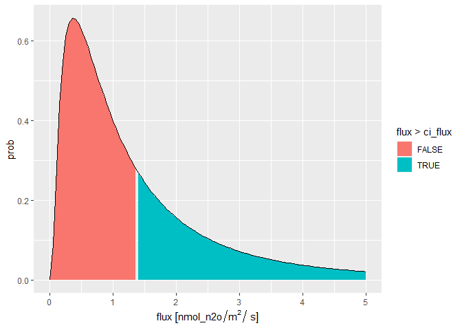
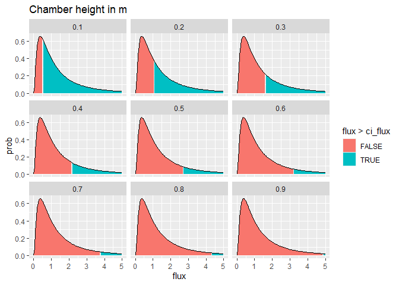
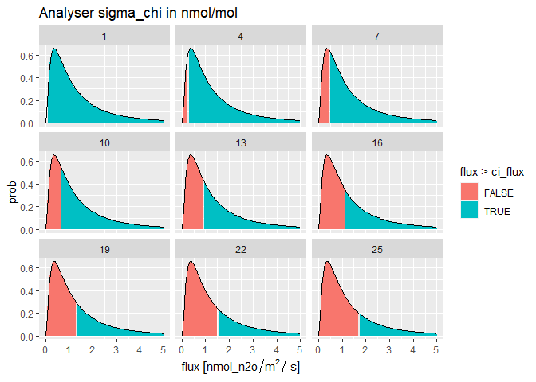

<!-- README.md is generated from README.Rmd. Please edit that file -->

<!--- { rendering -->

<!--- } -->

<!--- { startup -->

<!--- } -->

## Abstract
Chamber-based measurements of N$_2$O and CH$_4$ fluxes have particular characteristics which make statistical inference problematic:  fluxes are typically not normally distributed, but are heavily right-skewed; the precision of analysers is low in relation to the measured signal; the signal to noise ratio is small, often below the detection limits as conventionally defined; measurements are variable in time and space, and show peaks and hot spots which are unpredictable. To estimate the effect of treatments on the cumulative flux requires us to quantify and propagate the uncertainty properly.
We present guidelines for how to do this, and analysis of the necessary sample size (power analysis). We consider the uncertainty in individual flux measurements, spatial means, cumulative fluxes at the field scale, and between-treatment differences in emission factors. We show how these depend on: chamber height; analyser precision; the number of chamber measurements; the length of time and number of gas samples per measurement; and the magnitude and skewness of the spatial and temporal distributions.  The number of samples required to detect differences is larger than is commonly assumed.

## Individual chamber flux measurements
We can define a function which calculates the 95% confidence interval (CI) in chamber flux measurements, given the characteristic of the chamber and analyser.


```r
get_ci_dist
```

```
## function(
##   meanlog = 0, sdlog = 1, max_flux = 5, SI_prefix = "nano", 
##   height = 0.23, noise = 20, t_max = 300, n = 10) {
##   v_flux <- seq(0, max_flux, by = max_flux/100)
##   sigma_x <- get_sigma_x(x_max = t_max, n)
##   v_prob <- dlnorm(v_flux, meanlog, sdlog)
##   ci_b <- sqrt(noise^2 / ((n-1) * sigma_x^2)) * 1.96
##   # convert ci_b from mol/mol/s to flux units mol/m2/s - check correct
##   ci_flux <- ci_b * rho * height
##   snr <- v_flux^2 / noise^2
##   df <- data.table(prob = v_prob, flux = v_flux, ci_flux = ci_flux, snr = snr, 
##     noise = noise, t_max = t_max, height = height)
##   return(df)
## }
```

To illustrate, we can calculate the CI in flux measurements from a chamber of height 0.23 m and an analyser with noise of 20 nmol/mol (standard deviation) and 10 samples recorded over 5 minutes. 
 

```r
get_ci_dist(height = 0.23, meanlog = 0, sdlog = 1, max_flux = 5, 
  SI_prefix = "nano", noise = 20, t_max = 5*60, n = 10)
```

```
##            prob flux ci_flux        snr noise t_max height
##   1: 0.00000000 0.00 1.24303 0.00000000    20   300   0.23
##   2: 0.08977828 0.05 1.24303 0.00000625    20   300   0.23
##   3: 0.28159019 0.10 1.24303 0.00002500    20   300   0.23
##   4: 0.43983718 0.15 1.24303 0.00005625    20   300   0.23
##   5: 0.54626787 0.20 1.24303 0.00010000    20   300   0.23
##  ---                                                      
##  97: 0.02428655 4.80 1.24303 0.05760000    20   300   0.23
##  98: 0.02364735 4.85 1.24303 0.05880625    20   300   0.23
##  99: 0.02302884 4.90 1.24303 0.06002500    20   300   0.23
## 100: 0.02243021 4.95 1.24303 0.06125625    20   300   0.23
## 101: 0.02185071 5.00 1.24303 0.06250000    20   300   0.23
```

The CI is a constant value given these characteristics. However, we might also consider this in relative terms compared to the flux itself, rather like a signal-to-noise ratio (SNR).
Therefore, we express this in relation to a range of typical or possible fluxes, up to a maximum value `max_flux`, with their probability of occuring specified by a lognormal distribution, with the parameter `meanlog` and `sdlog`.


```r
dt <- get_ci_dist(height = 0.23, meanlog = 0, sdlog = 1, max_flux = 5, 
  SI_prefix = "nano", noise = 20, t_max = 5*60, n = 10)
p <- ggplot(dt, aes(flux, prob))
p <- p + geom_area(aes(fill = flux > ci_flux))
p <- p + geom_line()
p
```

<!-- -->

The figure above shows the specified distribution of flux values in relation to the calculated CI of 1.24 nmol/m$^2$/s. This shows that 
31% of fluxes (shaded red) will be lower than the CI, which can be considered as a limit of detection for the chamber-analyser system. 

### Variation in CI with chamber height

Using this function, we can examine how CI varies with various properties of the chamber-analyser system. Firstly, we see how CI is influenced by chamber height.


```r
v_height <- seq(0.1, 0.9, by = 0.1)
l_dt <- lapply(v_height, function(i){get_ci_dist(height = i)})
dt <- rbindlist(l_dt)
p <- ggplot(dt, aes(flux, prob))
p <- p + geom_area(aes(fill = flux > ci_flux))
p <- p + geom_line()
p <- p + facet_wrap(~ height) + ggtitle("Chamber height in m")
p
```

<!-- -->

### Variation in CI with analyser noise

Secondly, we see how CI is influenced by analyser noise.


```r
v_noise <- seq(1, 27, by = 3)
l_dt <- lapply(v_noise, function(i){get_ci_dist(noise = i)})
dt <- rbindlist(l_dt)
p <- ggplot(dt, aes(flux, prob))
p <- p + geom_area(aes(fill = flux > ci_flux))
p <- p + geom_line()
p <- p + facet_wrap(~ noise) + ggtitle("Analyser noise in nmol/mol")
p
```

<!-- -->
