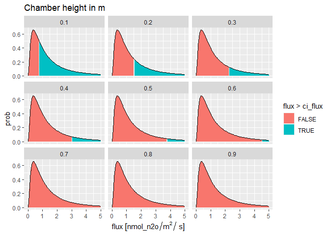

<!-- README.md is generated from README.Rmd. Please edit that file -->

<!--- { rendering -->

<!--- } -->

<!--- { startup -->

<!--- } -->

## Abstract
Chamber-based measurements of N2O and CH4 fluxes have particular characteristics which make statistical inference problematic:  fluxes are typically not normally distributed, but are heavily right-skewed; the precision of analysers is low in relation to the measured signal; the signal to noise ratio is small, often below the detection limits as conventionally defined; measurements are variable in time and space, and show peaks and hot spots which are unpredictable. To estimate the effect of treatments on the cumulative flux requires us to quantify and propagate the uncertainty properly.
We present guidelines for how to do this, and analysis of the necessary sample size (power analysis). We consider the uncertainty in individual flux measurements, spatial means, cumulative fluxes at the field scale, and between-treatment differences in emission factors. We show how these depend on: chamber height; analyser precision; the number of chamber measurements; the length of time and number of gas samples per measurement; and the magnitude and skewness of the spatial and temporal distributions.  The number of samples required to detect differences is larger than is commonly assumed.

## Individual chamber flux measurements
The flux of a GHG from the soil surface within a chamber is calculated from the rate of change in the mixing ratio $d \chi / d t$ (in mol GHG/mol air/ s), adjusted for the density of air per unit surface area:

$$F = \frac{d \chi} {d t} \times \rho \frac{V}{A}$$

where $F$ is the surface flux in mol GHG/m^2^/s, $\rho$ is the density of air in mol/m^3^, and $V$ and $A$ are the volume and area of the chamber (which simplifies to the height $h = V/A$ for most common chamber shapes). The term $\rho h$ can be considered a constant for a given chamber under typical conditions.

The term $d \chi / d t$ is usually estimated as the slope $\beta$ of a linear regression between $\chi$ and time $t$ during the chamber closure (although various methods accounting for non-linearity are also used).
The uncertainty in this term is estimated by the standard algebra of linear regression, where the 95% confidence interval (CI) in the slope $\beta$ is given:

$$CI_{\beta}^{95} = \sqrt{ \frac{\sigma^2} {n-1 \sum (t_i - \bar{t})^2} } \times \mathbb{T}$$

where $\sigma^2$ is the residual variance, $n$ is the number of data points, $\sum (t_i - \bar{t})^2$ is the variance in the $x$ independent variable, time, and $\mathbb{T}$ represents the t statistic, with a value of 1.96 for a sample size greater than 20. We can define a function which calculates this 95% confidence interval in chamber flux measurements, given the characteristic of the chamber and analyser.


```r
get_ci
```

```
## function(
##   noise = 20, 
##   SI_prefix = "nano", 
##   height = 0.23, 
##   t_max = 300, 
##   n = 10) {
##   
##   sigma_x <- get_sigma_x(x_max = t_max, n)
##   ci_b <- sqrt(noise^2 / ((n-1) * sigma_x^2)) * 1.96
##   # convert ci_b from mol/mol/s to flux units mol/m2/s - check correct
##   ci_flux <- ci_b * rho * height
##   return(ci_flux)
## }
```

To illustrate, we can calculate the CI in flux measurements from a chamber of height 0.23 m and an analyser with noise of 20 nmol/mol (standard deviation) and 10 samples recorded over 5 minutes. 
 

```r
get_ci_dist(height = 0.23, meanlog = 0, sdlog = 1, max_flux = 5, 
  SI_prefix = "nano", noise = 20, t_max = 5*60, n = 10)
```

```
##            prob flux ci_flux        snr noise t_max height
##   1: 0.00000000 0.00 1.24303 0.00000000    20   300   0.23
##   2: 0.08977828 0.05 1.24303 0.00000625    20   300   0.23
##   3: 0.28159019 0.10 1.24303 0.00002500    20   300   0.23
##   4: 0.43983718 0.15 1.24303 0.00005625    20   300   0.23
##   5: 0.54626787 0.20 1.24303 0.00010000    20   300   0.23
##  ---                                                      
##  97: 0.02428655 4.80 1.24303 0.05760000    20   300   0.23
##  98: 0.02364735 4.85 1.24303 0.05880625    20   300   0.23
##  99: 0.02302884 4.90 1.24303 0.06002500    20   300   0.23
## 100: 0.02243021 4.95 1.24303 0.06125625    20   300   0.23
## 101: 0.02185071 5.00 1.24303 0.06250000    20   300   0.23
```

The CI is a constant value given these characteristics. However, we might also consider this in relative terms compared to the flux itself, rather like a signal-to-noise ratio (SNR).
Therefore, we express this in relation to a range of typical or possible fluxes, up to a maximum value `max_flux`, with their probability of occuring specified by a lognormal distribution, with the parameter `meanlog` and `sdlog`.


```r
dt <- get_ci_dist(height = 0.23, meanlog = 0, sdlog = 1, max_flux = 5, 
  SI_prefix = "nano", noise = 20, t_max = 5*60, n = 10)
p <- ggplot(dt, aes(flux, prob))
p <- p + geom_area(aes(fill = flux > ci_flux))
p <- p + geom_line()
p
```

<!-- -->

The figure above shows the specified distribution of flux values in relation to the calculated CI of 1.24 nmol/m^2^/s. This shows that 
31% of fluxes (shaded red) will be lower than the CI, which can be considered as a limit of detection for the chamber-analyser system. 

### Variation in CI with chamber height

Using this function, we can examine how CI varies with various properties of the chamber-analyser system. Firstly, we see how CI is influenced by chamber height.


```r
v_height <- seq(0.1, 0.9, by = 0.1)
l_dt <- lapply(v_height, function(i){get_ci_dist(height = i)})
dt_h <- rbindlist(l_dt)
p <- ggplot(dt_h, aes(flux, prob))
p <- p + geom_area(aes(fill = flux > ci_flux))
p <- p + geom_line()
p <- p + facet_wrap(~ height) + ggtitle("Chamber height in m")
p
```

<!-- -->

### Variation in CI with analyser noise

Secondly, we see how CI is influenced by analyser noise.


```r
v_noise <- seq(1, 27, by = 3)
l_dt <- lapply(v_noise, function(i){get_ci_dist(noise = i)})
dt_noise <- rbindlist(l_dt)
p <- ggplot(dt_noise, aes(flux, prob))
p <- p + geom_area(aes(fill = flux > ci_flux))
p <- p + geom_line()
p <- p + facet_wrap(~ noise) + ggtitle("Analyser noise in nmol/mol")
p
```

<!-- -->

### Combine sources of variation in CI

We can plot the effect of both of these on CI as an image, showing how the percentage of fluxes which will be detectable (greater than the upper CI) varies with chamber height and analyser noise. 


```r
dt <- data.table(expand.grid(height = v_height, noise = v_noise))
dt[, ci_flux := get_ci(height = height, noise = noise)]
dt[, percent_detectable := get_percent_detectable(height = height, noise = noise)]

p <- ggplot(dt, aes(height, noise, fill = percent_detectable, 
  text = paste("CI:", round(ci_flux, 3)))) + 
  geom_tile() +
  scale_fill_viridis(discrete=FALSE) +
  theme_ipsum()

ggplotly(p, tooltip = "text")
```

```{=html}
<div id="htmlwidget-248b1356741d76384081" style="width:672px;height:480px;" class="plotly html-widget"></div>
<script type="application/json" data-for="htmlwidget-248b1356741d76384081">{"x":{"data":[{"x":[0.1,0.2,0.3,0.4,0.5,0.6,0.7,0.8,0.9],"y":[1,4,7,10,13,16,19,22,25],"z":[[1,0.998331151364669,0.993941913120332,0.986627728611418,0.976658326590299,0.964453311012772,0.950445450587883,0.935029088851387,0.918544667028742],[0.986627728611418,0.935029088851387,0.865301202951046,0.791849107196951,0.721037261640629,0.65535824463473,0.595551701954748,0.541576065078979,0.493058026755677],[0.950445450587883,0.828515152885393,0.704087585636353,0.595551701954748,0.504702025731825,0.429425752713844,0.367020650086451,0.315048416291777,0.271500515416676],[0.901278091619338,0.721037261640629,0.567853801759341,0.449503509925828,0.35900887501107,0.289243741547709,0.234772688361132,0.191676419530482,0.157148801391608],[0.846941882949104,0.624712088698738,0.45995519568612,0.343596414845021,0.260372083243709,0.199533435253991,0.154084006598617,0.119458348051085,0.0926177385497263],[0.791849107196951,0.541576065078979,0.375244591985097,0.265869018525068,0.191676419530482,0.139678046528816,0.10216833057622,0.0744338321416595,0.0534895921952225],[0.738315625981719,0.47069276301395,0.308353013344424,0.207750136619045,0.142442013764253,0.0982411178286597,0.0672670603059593,0.0449254692889206,0.0284149779367556],[0.687483803584847,0.410396614394248,0.255005777758301,0.1634751146288,0.106246156308701,0.0686512983929373,0.0429503185872045,0.0248001364853197,0.0116325585481881],[0.639848995534451,0.35900887501107,0.211999788721265,0.129165133925569,0.0790440056236923,0.0469643335937553,0.0255020867992372,0.0106223929883094,0]],"text":[["CI: 0.027","CI: 0.054","CI: 0.081","CI: 0.108","CI: 0.135","CI: 0.162","CI: 0.189","CI: 0.216","CI: 0.243"],["CI: 0.108","CI: 0.216","CI: 0.324","CI: 0.432","CI: 0.54","CI: 0.649","CI: 0.757","CI: 0.865","CI: 0.973"],["CI: 0.189","CI: 0.378","CI: 0.567","CI: 0.757","CI: 0.946","CI: 1.135","CI: 1.324","CI: 1.513","CI: 1.702"],["CI: 0.27","CI: 0.54","CI: 0.811","CI: 1.081","CI: 1.351","CI: 1.621","CI: 1.892","CI: 2.162","CI: 2.432"],["CI: 0.351","CI: 0.703","CI: 1.054","CI: 1.405","CI: 1.756","CI: 2.108","CI: 2.459","CI: 2.81","CI: 3.162"],["CI: 0.432","CI: 0.865","CI: 1.297","CI: 1.729","CI: 2.162","CI: 2.594","CI: 3.027","CI: 3.459","CI: 3.891"],["CI: 0.513","CI: 1.027","CI: 1.54","CI: 2.054","CI: 2.567","CI: 3.081","CI: 3.594","CI: 4.107","CI: 4.621"],["CI: 0.594","CI: 1.189","CI: 1.783","CI: 2.378","CI: 2.972","CI: 3.567","CI: 4.161","CI: 4.756","CI: 5.35"],["CI: 0.676","CI: 1.351","CI: 2.027","CI: 2.702","CI: 3.378","CI: 4.053","CI: 4.729","CI: 5.404","CI: 6.08"]],"colorscale":[[0,"#440154"],[0.0106223929883094,"#450558"],[0.0116325585481881,"#450559"],[0.0248001364853197,"#460A5D"],[0.0255020867992372,"#460B5E"],[0.0284149779367556,"#460C5E"],[0.0429503185872045,"#471164"],[0.0449254692889206,"#471264"],[0.0469643335937553,"#471365"],[0.0534895921952225,"#481568"],[0.0672670603059593,"#481A6C"],[0.0686512983929373,"#481B6D"],[0.0744338321416595,"#481C6E"],[0.0790440056236923,"#481D6F"],[0.0926177385497263,"#482274"],[0.0982411178286597,"#482475"],[0.10216833057622,"#482576"],[0.106246156308701,"#482677"],[0.119458348051085,"#472B7A"],[0.129165133925569,"#472E7C"],[0.139678046528816,"#46317E"],[0.142442013764253,"#46327E"],[0.154084006598617,"#453681"],[0.157148801391608,"#453781"],[0.1634751146288,"#443983"],[0.191676419530482,"#424186"],[0.199533435253991,"#414487"],[0.207750136619045,"#404688"],[0.211999788721265,"#3F4788"],[0.234772688361132,"#3D4E8A"],[0.255005777758301,"#3A538B"],[0.260372083243709,"#3A548C"],[0.265869018525068,"#39568C"],[0.271500515416676,"#38588C"],[0.289243741547709,"#365D8D"],[0.308353013344424,"#33628D"],[0.315048416291777,"#33638D"],[0.343596414845021,"#2F6B8E"],[0.35900887501107,"#2E6F8E"],[0.35900887501107,"#2E6F8E"],[0.367020650086451,"#2D718E"],[0.375244591985097,"#2C728E"],[0.410396614394248,"#297B8E"],[0.429425752713844,"#27808E"],[0.449503509925828,"#25848E"],[0.45995519568612,"#24868E"],[0.47069276301395,"#23898E"],[0.493058026755677,"#218F8D"],[0.504702025731825,"#20928C"],[0.541576065078979,"#1F9A8A"],[0.567853801759341,"#1FA188"],[0.595551701954748,"#22A785"],[0.624712088698738,"#27AD81"],[0.639848995534451,"#2CB17E"],[0.65535824463473,"#31B57B"],[0.687483803584847,"#3EBC74"],[0.704087585636353,"#45C06F"],[0.721037261640629,"#4EC36B"],[0.721037261640629,"#4EC36B"],[0.738315625981719,"#57C666"],[0.791849107196951,"#75D054"],[0.828515152885393,"#8CD646"],[0.846941882949104,"#98D83E"],[0.865301202951046,"#A4DB36"],[0.901278091619338,"#BCDF26"],[0.918544667028742,"#C8E020"],[0.935029088851387,"#D3E21B"],[0.950445450587883,"#DEE318"],[0.964453311012772,"#E7E419"],[0.976658326590299,"#EFE51C"],[0.986627728611418,"#F5E61F"],[0.993941913120332,"#F9E622"],[0.998331151364669,"#FCE724"],[1,"#FDE725"]],"type":"heatmap","showscale":false,"autocolorscale":false,"showlegend":false,"xaxis":"x","yaxis":"y","hoverinfo":"text","frame":null},{"x":[0.25],"y":[0],"name":"99_ccbbd698cdce0acf25e45a6c81198196","type":"scatter","mode":"markers","opacity":0,"hoverinfo":"skip","showlegend":false,"marker":{"color":[0,1],"colorscale":[[0,"#440154"],[0.00334448160535114,"#440256"],[0.00668896321070228,"#450357"],[0.0100334448160536,"#450558"],[0.0133779264214047,"#450659"],[0.0167224080267559,"#46075B"],[0.020066889632107,"#46085C"],[0.0234113712374581,"#460A5D"],[0.0267558528428094,"#460B5E"],[0.0301003344481606,"#470C5F"],[0.0334448160535117,"#470E61"],[0.0367892976588629,"#470F62"],[0.040133779264214,"#471063"],[0.0434782608695651,"#471164"],[0.0468227424749164,"#471365"],[0.0501672240802676,"#481467"],[0.0535117056856187,"#481568"],[0.0568561872909699,"#481768"],[0.060200668896321,"#481769"],[0.0635451505016723,"#48186A"],[0.0668896321070234,"#481A6C"],[0.0702341137123746,"#481B6D"],[0.0735785953177257,"#481C6E"],[0.0769230769230769,"#481D6F"],[0.0802675585284282,"#481E6F"],[0.0836120401337793,"#481F70"],[0.0869565217391304,"#482071"],[0.0903010033444816,"#482173"],[0.0936454849498327,"#482374"],[0.096989966555184,"#482475"],[0.100334448160535,"#482576"],[0.103678929765886,"#482576"],[0.107023411371237,"#482777"],[0.110367892976589,"#482878"],[0.11371237458194,"#482979"],[0.117056856187291,"#472A7A"],[0.120401337792642,"#472B7A"],[0.123745819397993,"#472D7B"],[0.127090301003344,"#472D7B"],[0.130434782608696,"#472E7C"],[0.133779264214047,"#472F7D"],[0.137123745819398,"#46307E"],[0.140468227424749,"#46327E"],[0.1438127090301,"#46337F"],[0.147157190635451,"#463480"],[0.150501672240803,"#463480"],[0.153846153846154,"#453581"],[0.157190635451505,"#453781"],[0.160535117056856,"#453882"],[0.163879598662207,"#443983"],[0.167224080267559,"#443A83"],[0.17056856187291,"#443A83"],[0.173913043478261,"#443C84"],[0.177257525083612,"#433D84"],[0.180602006688963,"#433E85"],[0.183946488294314,"#423F85"],[0.187290969899666,"#424086"],[0.190635451505017,"#424186"],[0.193979933110368,"#424186"],[0.197324414715719,"#414387"],[0.20066889632107,"#414487"],[0.204013377926421,"#404588"],[0.207357859531773,"#404688"],[0.210702341137124,"#3F4788"],[0.214046822742475,"#3F4889"],[0.217391304347826,"#3F4889"],[0.220735785953177,"#3E4989"],[0.224080267558528,"#3E4A89"],[0.22742474916388,"#3E4C8A"],[0.230769230769231,"#3D4D8A"],[0.234113712374582,"#3D4E8A"],[0.237458193979933,"#3C4F8A"],[0.240802675585284,"#3C4F8A"],[0.244147157190635,"#3C508B"],[0.247491638795987,"#3B518B"],[0.250836120401338,"#3B528B"],[0.254180602006689,"#3A538B"],[0.25752508361204,"#3A548C"],[0.260869565217391,"#39558C"],[0.264214046822742,"#39558C"],[0.267558528428094,"#39568C"],[0.270903010033445,"#38588C"],[0.274247491638796,"#38598C"],[0.277591973244147,"#375A8C"],[0.280936454849498,"#375B8D"],[0.284280936454849,"#375B8D"],[0.287625418060201,"#365C8D"],[0.290969899665552,"#365D8D"],[0.294314381270903,"#355E8D"],[0.297658862876254,"#355F8D"],[0.301003344481605,"#34608D"],[0.304347826086957,"#34618D"],[0.307692307692308,"#34618D"],[0.311036789297659,"#33628D"],[0.31438127090301,"#33638D"],[0.317725752508361,"#32648E"],[0.321070234113712,"#32658E"],[0.324414715719063,"#31668E"],[0.327759197324415,"#31678E"],[0.331103678929766,"#31678E"],[0.334448160535117,"#31688E"],[0.337792642140468,"#30698E"],[0.341137123745819,"#306A8E"],[0.344481605351171,"#2F6B8E"],[0.347826086956522,"#2F6C8E"],[0.351170568561873,"#2E6D8E"],[0.354515050167224,"#2E6D8E"],[0.357859531772575,"#2E6E8E"],[0.361204013377926,"#2E6F8E"],[0.364548494983278,"#2D708E"],[0.367892976588629,"#2D718E"],[0.37123745819398,"#2C718E"],[0.374581939799331,"#2C728E"],[0.377926421404682,"#2C728E"],[0.381270903010033,"#2C738E"],[0.384615384615385,"#2B748E"],[0.387959866220736,"#2B758E"],[0.391304347826087,"#2A768E"],[0.394648829431438,"#2A778E"],[0.397993311036789,"#2A778E"],[0.40133779264214,"#2A788E"],[0.404682274247492,"#29798E"],[0.408026755852843,"#297A8E"],[0.411371237458194,"#297B8E"],[0.414715719063545,"#287C8E"],[0.418060200668896,"#287D8E"],[0.421404682274247,"#287D8E"],[0.424749163879599,"#277E8E"],[0.42809364548495,"#277F8E"],[0.431438127090301,"#27808E"],[0.434782608695652,"#26818E"],[0.438127090301003,"#26828E"],[0.441471571906355,"#26828E"],[0.444816053511706,"#26828E"],[0.448160535117057,"#25838E"],[0.451505016722408,"#25848E"],[0.454849498327759,"#25858E"],[0.45819397993311,"#24868E"],[0.461538461538462,"#24878E"],[0.464882943143813,"#23888E"],[0.468227424749164,"#23888E"],[0.471571906354515,"#23898E"],[0.474916387959866,"#238A8D"],[0.478260869565217,"#228B8D"],[0.481605351170569,"#228C8D"],[0.48494983277592,"#228D8D"],[0.488294314381271,"#218E8D"],[0.491638795986622,"#218E8D"],[0.494983277591973,"#218F8D"],[0.498327759197324,"#21908D"],[0.501672240802676,"#21918C"],[0.505016722408027,"#20928C"],[0.508361204013378,"#20928C"],[0.511705685618729,"#20928C"],[0.51505016722408,"#20938C"],[0.518394648829431,"#1F948C"],[0.521739130434783,"#1F958B"],[0.525083612040134,"#1F968B"],[0.528428093645485,"#1F978B"],[0.531772575250836,"#1F988B"],[0.535117056856187,"#1F988B"],[0.538461538461539,"#1F998A"],[0.54180602006689,"#1F9A8A"],[0.545150501672241,"#1E9B8A"],[0.548494983277592,"#1E9C89"],[0.551839464882943,"#1E9D89"],[0.555183946488294,"#1F9E89"],[0.558528428093646,"#1F9E89"],[0.561872909698997,"#1F9F88"],[0.565217391304348,"#1FA088"],[0.568561872909699,"#1FA188"],[0.57190635451505,"#1FA187"],[0.575250836120401,"#1FA287"],[0.578595317725752,"#20A386"],[0.581939799331104,"#20A386"],[0.585284280936455,"#20A486"],[0.588628762541806,"#21A585"],[0.591973244147157,"#21A685"],[0.595317725752508,"#22A785"],[0.59866220735786,"#22A884"],[0.602006688963211,"#23A983"],[0.605351170568562,"#23A983"],[0.608695652173913,"#24AA83"],[0.612040133779264,"#25AB82"],[0.615384615384615,"#25AC82"],[0.618729096989967,"#26AD81"],[0.622073578595318,"#27AD81"],[0.625418060200669,"#27AD81"],[0.62876254180602,"#28AE80"],[0.632107023411371,"#29AF7F"],[0.635451505016722,"#2AB07F"],[0.638795986622074,"#2CB17E"],[0.642140468227425,"#2DB27D"],[0.645484949832776,"#2EB37C"],[0.648829431438127,"#2EB37C"],[0.652173913043478,"#30B47C"],[0.655518394648829,"#31B57B"],[0.658862876254181,"#32B67A"],[0.662207357859532,"#34B679"],[0.665551839464883,"#35B779"],[0.668896321070234,"#36B878"],[0.672240802675585,"#37B878"],[0.675585284280937,"#39B977"],[0.678929765886288,"#3ABA76"],[0.682274247491639,"#3BBB75"],[0.68561872909699,"#3DBC74"],[0.688963210702341,"#3EBC73"],[0.692307692307692,"#40BD72"],[0.695652173913044,"#41BD72"],[0.698996655518395,"#42BE71"],[0.702341137123746,"#44BF70"],[0.705685618729097,"#46C06F"],[0.709030100334448,"#48C16E"],[0.712374581939799,"#49C16D"],[0.715719063545151,"#4BC26C"],[0.719063545150502,"#4DC26C"],[0.722408026755853,"#4EC36B"],[0.725752508361204,"#50C46A"],[0.729096989966555,"#52C569"],[0.732441471571906,"#54C568"],[0.735785953177257,"#55C667"],[0.739130434782609,"#57C666"],[0.74247491638796,"#59C765"],[0.745819397993311,"#5AC864"],[0.749163879598662,"#5CC863"],[0.752508361204013,"#5EC962"],[0.755852842809364,"#5FCA61"],[0.759197324414716,"#62CB5F"],[0.762541806020067,"#64CB5F"],[0.765886287625418,"#66CB5D"],[0.769230769230769,"#67CC5C"],[0.77257525083612,"#69CD5B"],[0.775919732441471,"#6CCD5A"],[0.779264214046823,"#6DCE59"],[0.782608695652174,"#6FCF57"],[0.785953177257525,"#71CF57"],[0.789297658862876,"#74D055"],[0.792642140468227,"#75D054"],[0.795986622073579,"#77D153"],[0.79933110367893,"#79D151"],[0.802675585284281,"#7BD250"],[0.806020066889632,"#7ED34F"],[0.809364548494983,"#80D34E"],[0.812709030100335,"#82D34D"],[0.816053511705686,"#84D44B"],[0.819397993311037,"#86D549"],[0.822742474916388,"#88D548"],[0.826086956521739,"#8AD647"],[0.82943143812709,"#8DD645"],[0.832775919732442,"#8FD644"],[0.836120401337793,"#91D743"],[0.839464882943144,"#93D741"],[0.842809364548495,"#95D840"],[0.846153846153846,"#97D83E"],[0.849498327759197,"#9AD93D"],[0.852842809364549,"#9CD93C"],[0.8561872909699,"#9ED93A"],[0.859531772575251,"#A0DA39"],[0.862876254180602,"#A2DA37"],[0.866220735785953,"#A5DB36"],[0.869565217391304,"#A7DB35"],[0.872909698996656,"#A9DC33"],[0.876254180602007,"#ABDC31"],[0.879598662207358,"#AEDC30"],[0.882943143812709,"#B0DD2F"],[0.88628762541806,"#B2DD2D"],[0.889632107023411,"#B5DE2B"],[0.892976588628763,"#B7DE2A"],[0.896321070234114,"#B9DE28"],[0.899665551839465,"#BBDE27"],[0.903010033444816,"#BEDF26"],[0.906354515050167,"#C0DF25"],[0.909698996655518,"#C2DF23"],[0.91304347826087,"#C4E021"],[0.916387959866221,"#C7E020"],[0.919732441471572,"#C9E11F"],[0.923076923076923,"#CBE11E"],[0.926421404682274,"#CEE11D"],[0.929765886287625,"#D0E11C"],[0.933110367892977,"#D2E21B"],[0.936454849498328,"#D4E21A"],[0.939799331103679,"#D7E219"],[0.94314381270903,"#D9E319"],[0.946488294314381,"#DBE319"],[0.949832775919732,"#DDE318"],[0.953177257525084,"#DFE318"],[0.956521739130435,"#E2E418"],[0.959866220735786,"#E4E419"],[0.963210702341137,"#E6E419"],[0.966555183946488,"#E8E419"],[0.96989966555184,"#EBE51A"],[0.973244147157191,"#EDE51B"],[0.976588628762542,"#EFE51C"],[0.979933110367893,"#F1E51D"],[0.983277591973244,"#F3E61E"],[0.986622073578595,"#F5E61F"],[0.989966555183947,"#F7E620"],[0.993311036789298,"#F9E622"],[0.996655518394649,"#FBE723"],[1,"#FDE725"]],"colorbar":{"bgcolor":null,"bordercolor":null,"borderwidth":0,"thickness":23.04,"title":"percent_detectable","titlefont":{"color":"rgba(0,0,0,1)","family":"Arial Narrow","size":15.2760481527605},"tickmode":"array","ticktext":["-75","-50","-25","0"],"tickvals":[0.212030640313025,0.471283093791024,0.730535547269023,0.989788000747023],"tickfont":{"color":"rgba(0,0,0,1)","family":"Arial Narrow","size":12.2208385222084},"ticklen":2,"len":0.5}},"xaxis":"x","yaxis":"y","frame":null}],"layout":{"margin":{"t":71.7907845579078,"r":39.8505603985056,"b":86.8410128684101,"l":70.9007887090079},"font":{"color":"rgba(0,0,0,1)","family":"Arial Narrow","size":15.2760481527605},"xaxis":{"domain":[0,1],"automargin":true,"type":"linear","autorange":false,"range":[0.00500000000000002,0.995],"tickmode":"array","ticktext":["0.25","0.50","0.75"],"tickvals":[0.25,0.5,0.75],"categoryorder":"array","categoryarray":["0.25","0.50","0.75"],"nticks":null,"ticks":"","tickcolor":null,"ticklen":3.81901203819012,"tickwidth":0,"showticklabels":true,"tickfont":{"color":"rgba(77,77,77,1)","family":"Arial Narrow","size":15.2760481527605},"tickangle":-0,"showline":false,"linecolor":null,"linewidth":0,"showgrid":true,"gridcolor":"rgba(204,204,204,1)","gridwidth":0.265670402656704,"zeroline":false,"anchor":"y","title":{"text":"height","font":{"color":"rgba(0,0,0,1)","family":"Arial Narrow","size":11.9551681195517}},"hoverformat":".2f"},"yaxis":{"domain":[0,1],"automargin":true,"type":"linear","autorange":false,"range":[-1.85,27.85],"tickmode":"array","ticktext":["0","10","20"],"tickvals":[0,10,20],"categoryorder":"array","categoryarray":["0","10","20"],"nticks":null,"ticks":"","tickcolor":null,"ticklen":3.81901203819012,"tickwidth":0,"showticklabels":true,"tickfont":{"color":"rgba(77,77,77,1)","family":"Arial Narrow","size":15.2760481527605},"tickangle":-0,"showline":false,"linecolor":null,"linewidth":0,"showgrid":true,"gridcolor":"rgba(204,204,204,1)","gridwidth":0.265670402656704,"zeroline":false,"anchor":"x","title":{"text":"noise","font":{"color":"rgba(0,0,0,1)","family":"Arial Narrow","size":11.9551681195517}},"hoverformat":".2f"},"shapes":[{"type":"rect","fillcolor":null,"line":{"color":null,"width":0,"linetype":[]},"yref":"paper","xref":"paper","x0":0,"x1":1,"y0":0,"y1":1}],"showlegend":false,"legend":{"bgcolor":null,"bordercolor":null,"borderwidth":0,"font":{"color":"rgba(0,0,0,1)","family":"Arial Narrow","size":12.2208385222084},"title":{"text":"","font":{"color":"rgba(0,0,0,1)","family":"Arial Narrow","size":15.2760481527605}}},"hovermode":"closest","barmode":"relative"},"config":{"doubleClick":"reset","modeBarButtonsToAdd":["hoverclosest","hovercompare"],"showSendToCloud":false},"source":"A","attrs":{"3d0c63977234":{"x":{},"y":{},"fill":{},"text":{},"type":"heatmap"}},"cur_data":"3d0c63977234","visdat":{"3d0c63977234":["function (y) ","x"]},"highlight":{"on":"plotly_click","persistent":false,"dynamic":false,"selectize":false,"opacityDim":0.2,"selected":{"opacity":1},"debounce":0},"shinyEvents":["plotly_hover","plotly_click","plotly_selected","plotly_relayout","plotly_brushed","plotly_brushing","plotly_clickannotation","plotly_doubleclick","plotly_deselect","plotly_afterplot","plotly_sunburstclick"],"base_url":"https://plot.ly"},"evals":[],"jsHooks":[]}</script>
```

We can further dimensions for measurement length and number of data points.
